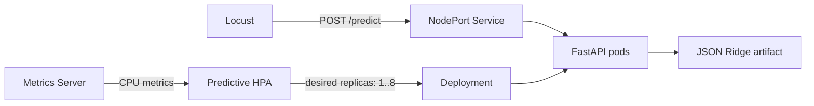
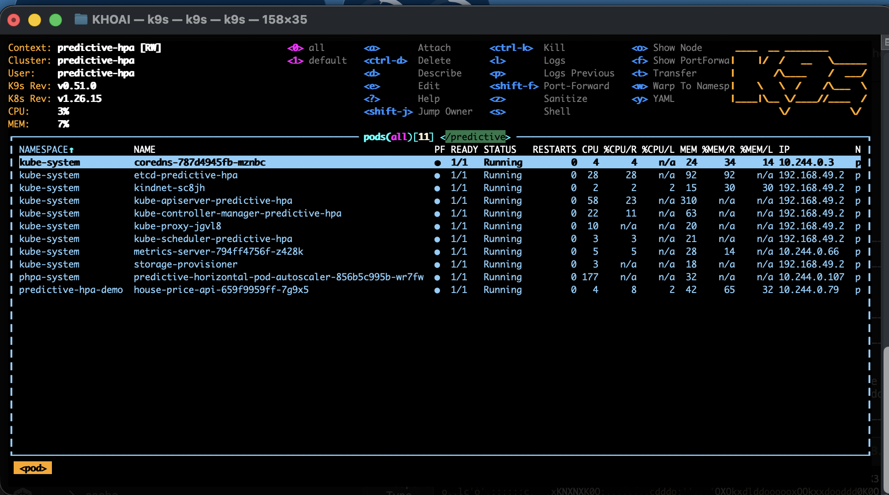
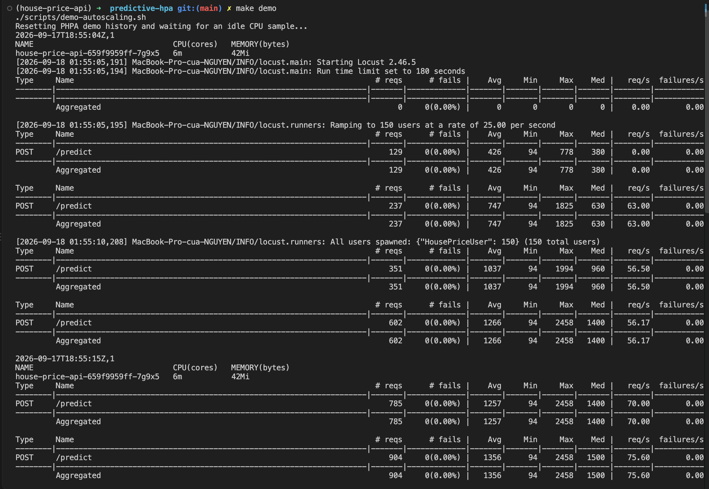
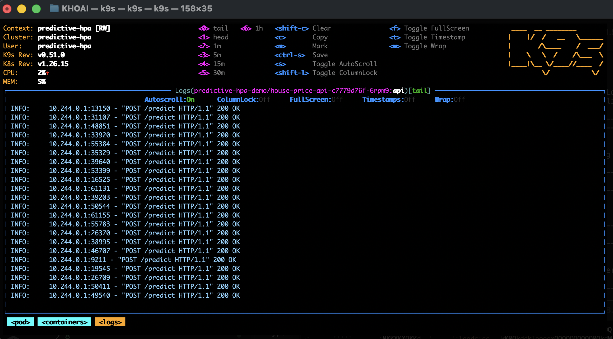
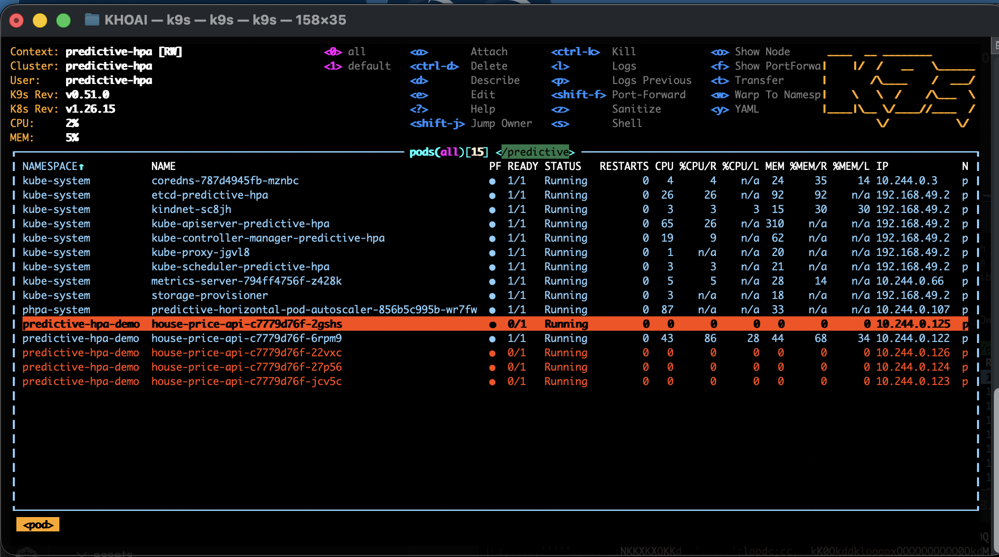
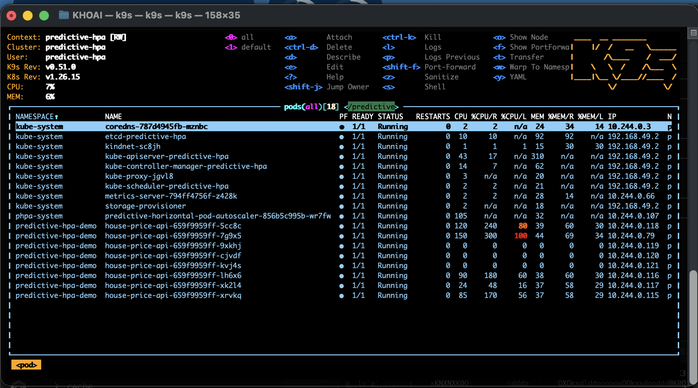

# FastAPI House Price Prediction with Predictive HPA

This project trains a lightweight Ridge regression model on a real housing
dataset, serves it through FastAPI, and uses the Predictive Horizontal Pod
Autoscaler (PHPA) to scale the API from 1 to 8 pods from real CPU utilization
on a local Minikube cluster.

> [!CAUTION]
> The model is an educational demonstration. Its training data only covers
> Sindian District, New Taipei City, during 2012–2013. Do not use its output for
> current property valuation, lending, or investment decisions.

## Architecture




- `main.py` creates the application, loads the model once during lifespan, and
  wires dependencies.
- `config.py` defines typed environment settings.
- `api.py` owns HTTP schemas, validation, dependency lookup, and routes.
- `domain.py` owns immutable entities, shared feature engineering, and unit
  conversion.
- `service.py` implements the prediction use case against the `PricePredictor`
  protocol.
- `predictor.py` validates the JSON artifact and performs Ridge inference.
- `training/` downloads the dataset, trains the model, evaluates it, and exports
  the runtime artifact.

Feature engineering is shared by training and inference to prevent
preprocessing drift. The runtime package is intentionally flat because the
service is small; training, tests, deployment, and load testing remain isolated
by responsibility.

```text
predictive-hpa/
├── src/house_price_api/
│   ├── __init__.py
│   ├── main.py
│   ├── config.py
│   ├── api.py
│   ├── domain.py
│   ├── service.py
│   ├── predictor.py
│   └── py.typed
├── training/
│   ├── __init__.py
│   ├── dataset.py
│   ├── pipeline.py
│   └── train.py
├── models/
│   ├── uci-real-estate-ridge-v1.json
│   └── MODEL_CARD.md
├── tests/
│   ├── unit/
│   └── integration/
├── loadtest/
│   └── locustfile.py
├── deploy/
│   ├── k8s/
│   │   ├── namespace.yaml
│   │   ├── application.yaml
│   │   └── phpa.yaml
│   └── operator/
│       └── Dockerfile
├── scripts/
│   ├── cluster-up.sh
│   ├── install-operator.sh
│   └── demo-autoscaling.sh
├── assets/
├── Dockerfile
├── Makefile
├── pyproject.toml
├── uv.lock
└── README.md
```

## Dataset and model

The project uses the [UCI Real Estate Valuation dataset][uci-dataset]: 414 real
transactions, six input variables, no missing values, and a CC BY 4.0 license.

The training pipeline:

1. Downloads the approximately 36 KB archive from UCI.
2. Verifies SHA-256
   `aa437bdac3ca23200258a0a58d251c0af90651aeaf7c7a07aaa714f0f9f25e2c`.
3. Adds `log1p(distance_to_mrt_m)` and `house_age_squared`.
4. Uses an 80/20 split with `random_state=42`.
5. Fits `StandardScaler + RidgeCV` with alpha candidates
   `[0.01, 0.1, 1, 10, 100]`.
6. Exports scaler parameters, coefficients, metadata, and evaluation metrics as
   a small JSON artifact.

The committed model selected `alpha=10`. On 83 holdout rows it achieved MAE
`4.368`, RMSE `6.528`, and R² `0.746`. MAE and RMSE use the dataset target unit,
`10,000 TWD/Ping`.

Pandas, OpenPyXL, and scikit-learn are training-only dependencies. The runtime
container reads the JSON artifact and performs the linear calculation without
those libraries. See [the model card](models/MODEL_CARD.md) for limitations and
intended use.

```bash
make install
make train
make quality
```

The downloaded source dataset is cached under `.cache/` and is not committed.

## Run the API locally

Requirements:

- Python 3.12
- [uv](https://docs.astral.sh/uv/)

```bash
make install
uv run uvicorn house_price_api.main:app --reload
```

OpenAPI documentation is available at <http://127.0.0.1:8000/docs>.

Health check:

```bash
curl http://127.0.0.1:8000/healthz
```

Prediction request:

```bash
curl --request POST http://127.0.0.1:8000/predict \
  --header 'content-type: application/json' \
  --data '{
    "transaction_date": 2013.5,
    "house_age_years": 10,
    "distance_to_mrt_m": 500,
    "nearby_convenience_stores": 5,
    "latitude": 24.98,
    "longitude": 121.54,
    "area_m2": 80
  }'
```

Example response:

```json
{
  "predicted_unit_price_10k_twd_per_ping": 46.26,
  "estimated_total_price_twd": 11214691.1,
  "model_version": "uci-real-estate-ridge-v1"
}
```

One Ping is approximately 3.3 m². The total estimate is calculated as:

```text
estimated_total_price_twd = unit_price * 10,000 * area_m2 / 3.3
```

## Set up Kubernetes locally

The setup creates a dedicated Minikube profile and Kubernetes context named
`predictive-hpa`. Every `kubectl` and Helm operation explicitly selects this
context. `minikube start` also uses `--keep-context`, so an existing GKE or other
current context is not replaced.

### Prerequisites

- Docker Desktop
- Minikube
- Helm
- `kubectl`
- `jq`
- At least 2 CPUs and 4 GiB of memory available to Minikube

Install Python dependencies first:

```bash
make install
```

Create the cluster, install Metrics Server and PHPA, build both images, and
deploy the API:

```bash
make setup
```

The equivalent step-by-step commands are:

```bash
make cluster
make operator
make deploy
```

If the `predictive-hpa` profile already exists with different resources or port
mappings, recreate it explicitly:

```bash
make destroy
make setup
```

### Minikube configuration

The cluster bootstrap is defined as follows:

```bash
minikube start \
  --profile "predictive-hpa" \
  --driver docker \
  --container-runtime containerd \
  --kubernetes-version "v1.26.15" \
  --cpus 2 \
  --memory 4096 \
  --ports "127.0.0.1:8000:30080" \
  --force \
  --keep-context

minikube addons enable metrics-server --profile "predictive-hpa"
```

Source: [`scripts/cluster-up.sh`, lines 15–31](scripts/cluster-up.sh#L15-L31).

| Setting | Meaning |
| --- | --- |
| `--profile predictive-hpa` | Isolates this lab from other Minikube profiles. |
| `--driver docker` | Runs the Minikube node as a Docker container. |
| `--container-runtime containerd` | Uses containerd inside the Kubernetes node. |
| `--kubernetes-version v1.26.15` | Matches the Kubernetes 0.26 client generation used by PHPA v0.13.2. |
| `--cpus 2`, `--memory 4096` | Keeps the node small enough for CPU pressure while leaving room for eight lightweight API pods. |
| `--ports 127.0.0.1:8000:30080` | Maps the API NodePort to a stable host URL. |
| `--keep-context` | Preserves the user's currently selected Kubernetes context. |
| Metrics Server | Supplies pod CPU samples consumed by the autoscaler. |

The script changes Metrics Server to a 15-second metric resolution. This is
closer to PHPA's 10-second synchronization period than its default 60-second
resolution and reduces repeated use of stale samples.

### Application resources and probes

The API pod uses deliberately small resource requests so real prediction
traffic can exceed the CPU target and trigger scaling:

```yaml
readinessProbe:
  httpGet:
    path: /healthz
    port: http
  initialDelaySeconds: 45
  periodSeconds: 5
  timeoutSeconds: 3
resources:
  requests:
    cpu: 50m
    memory: 64Mi
  limits:
    cpu: 150m
    memory: 128Mi
securityContext:
  allowPrivilegeEscalation: false
  capabilities:
    drop:
      - ALL
  readOnlyRootFilesystem: true
```

Source: [`deploy/k8s/application.yaml`, lines 29–57](deploy/k8s/application.yaml#L29-L57).

| Setting | Meaning |
| --- | --- |
| `requests.cpu: 50m` | PHPA utilization is measured against 50 millicores; a 50% target means approximately 25m average CPU per pod. |
| `limits.cpu: 150m` | Prevents one pod from consuming the entire two-core node during the demonstration. |
| `64Mi / 128Mi` memory | Leaves sufficient node capacity for the control plane, operator, Metrics Server, and up to eight API pods. |
| `initialDelaySeconds: 45` | Keeps interpreter and model startup CPU outside readiness-based autoscaling observations. |
| `runAsNonRoot` and container security context | Runs the application as UID 10001 without privilege escalation or a writable root filesystem. |

The service exposes port 80 internally and reserves NodePort `30080`, which the
Minikube host mapping publishes at <http://127.0.0.1:8000>.

Source: [`deploy/k8s/application.yaml`, lines 59–72](deploy/k8s/application.yaml#L59-L72).

### Predictive HPA configuration

The complete autoscaling policy is intentionally small and follows the PHPA
CPU-resource example:

```yaml
spec:
  scaleTargetRef:
    apiVersion: apps/v1
    kind: Deployment
    name: house-price-api
  minReplicas: 1
  maxReplicas: 8
  behavior:
    scaleDown:
      stabilizationWindowSeconds: 0
  metrics:
    - type: Resource
      resource:
        name: cpu
        target:
          averageUtilization: 50
          type: Utilization
  models:
    - type: Linear
      name: house-price-linear
      perSyncPeriod: 1
      linear:
        lookAhead: 10000
        historySize: 6
  decisionType: maximum
  syncPeriod: 10000
```

Source: [`deploy/k8s/phpa.yaml`, lines 7–31](deploy/k8s/phpa.yaml#L7-L31).

| Configuration | Meaning |
| --- | --- |
| `scaleTargetRef` | Gives PHPA control of the `house-price-api` Deployment replica count. |
| `minReplicas: 1` | Keeps one API pod available when the service is idle. |
| `maxReplicas: 8` | Caps the demo at eight pods so it fits on the two-core node. |
| `averageUtilization: 50` | Requests scaling when average pod CPU exceeds 50% of the configured CPU request. |
| `historySize: 6` | Fits the linear model over the latest six replica-demand observations. |
| `lookAhead: 10000` | Predicts required replicas 10,000 ms, or 10 seconds, into the future. |
| `perSyncPeriod: 1` | Runs the predictive model every PHPA reconciliation period. |
| `syncPeriod: 10000` | Reconciles metrics and replica decisions every 10 seconds. |
| `decisionType: maximum` | Chooses the highest recommendation among the metric calculation and predictive models. |
| `stabilizationWindowSeconds: 0` | Allows the demo to react to falling demand without an extra scale-down stabilization delay. |

Do not deploy a standard Kubernetes HPA against the same Deployment because two
controllers would compete to write the replica count. If a fresh run has
healthy CPU metrics but cannot reach eight pods, change
`averageUtilization: 50` to `30` and rerun the test.

### Application and operator images

`make deploy` builds the FastAPI image with the host Docker daemon, loads it
into Minikube, and applies the manifests:

```make
deploy:
	docker build --tag house-price-api:local .
	minikube image load --profile $(PROFILE) --overwrite=true house-price-api:local
	$(KUBE) apply --filename deploy/k8s/namespace.yaml
	$(KUBE) apply --filename deploy/k8s/application.yaml
	$(KUBE) rollout status deployment/house-price-api --namespace $(NAMESPACE) --timeout=180s
	$(KUBE) apply --filename deploy/k8s/phpa.yaml
```

Source: [`Makefile`, lines 35–43](Makefile#L35-L43).

The operator installer pins PHPA v0.13.2 to a source commit and SHA-256,
detects the Minikube node architecture, builds the regular multi-architecture
Dockerfile for `linux/arm64` or `linux/amd64`, and loads the resulting image into
Minikube. The image applies a narrowly scoped `1e-9` epsilon before `ceil()` in
the upstream linear-regression script so floating-point noise such as
`1.0000000000000002` cannot create a phantom second replica. A build-time smoke
test verifies that a constant six-sample history predicts exactly one replica.

Build and install source:

- [`deploy/operator/Dockerfile`, lines 1–26](deploy/operator/Dockerfile#L1-L26)
- [`scripts/install-operator.sh`, lines 24–61](scripts/install-operator.sh#L24-L61)

### Verify the deployment

```bash
make status
curl --fail http://127.0.0.1:8000/healthz
```

Wait until Metrics Server returns data before starting the demonstration:

```bash
minikube --profile predictive-hpa kubectl -- \
  --context predictive-hpa \
  top pods --namespace predictive-hpa-demo
```

Watch PHPA decisions:

```bash
make logs
```

In another terminal, watch the API Deployment and pods:

```bash
minikube --profile predictive-hpa kubectl -- \
  --context predictive-hpa \
  get deployment,pods,phpa \
  --namespace predictive-hpa-demo \
  --watch
```

## Load test and autoscaling demonstration

### Locust scenario

Each simulated user sends valid randomized house features to `POST /predict`
with a 10–50 ms wait between requests. Five percent of requests close their
connection so clients gradually reconnect through the Service and distribute
traffic to newly created pods without causing excessive connection churn. The
process exits unsuccessfully when the aggregate failure ratio is 1% or higher.

```python
class HousePriceUser(FastHttpUser):
    wait_time = between(0.01, 0.05)

    @task
    def predict_house_price(self) -> None:
        payload = {
            "transaction_date": random.uniform(2012.67, 2013.58),
            "house_age_years": random.uniform(0.0, 43.8),
            "distance_to_mrt_m": random.uniform(23.0, 6_488.0),
            "nearby_convenience_stores": random.randint(0, 10),
            "latitude": random.uniform(24.93, 25.01),
            "longitude": random.uniform(121.47, 121.57),
            "area_m2": random.uniform(30.0, 180.0),
        }
        with self.client.post(
            "/predict",
            json=payload,
            headers={"Connection": "close"} if random.random() < 0.05 else None,
            catch_response=True,
        ) as response:
            if response.status_code != 200:
                response.failure(f"unexpected status {response.status_code}")
                return
            body = response.json()
            if "estimated_total_price_twd" not in body:
                response.failure("prediction field is missing")


@events.quitting.add_listener
def set_exit_code(environment, **_kwargs) -> None:  # type: ignore[no-untyped-def]
    if environment.stats.total.fail_ratio >= 0.01:
        environment.process_exit_code = 1
```

Source: [`loadtest/locustfile.py`, lines 6–37](loadtest/locustfile.py#L6-L37).

### Headless command

The automated demo runs the following Locust command:

```bash
uv run --group load locust \
  --locustfile loadtest/locustfile.py \
  --headless \
  --users 150 \
  --spawn-rate 25 \
  --run-time 3m \
  --csv .artifacts/locust \
  --csv-full-history \
  --host http://127.0.0.1:8000
```

Source: [`scripts/demo-autoscaling.sh`, lines 44–52](scripts/demo-autoscaling.sh#L44-L52).

| Option | Meaning |
| --- | --- |
| `--group load` | Installs and uses the isolated Locust dependency group from `pyproject.toml`. |
| `--headless` | Runs without the Locust web UI, which makes the demo repeatable in a terminal or CI job. |
| `--users 150` | Maintains 150 concurrent simulated users. |
| `--spawn-rate 25` | Adds 25 users per second, reaching full load in approximately six seconds. |
| `--run-time 3m` | Keeps traffic active for three minutes. |
| `--csv` and `--csv-full-history` | Save aggregate and time-series evidence under `.artifacts/`. |
| `--host` | Sends traffic through the host-to-NodePort mapping instead of bypassing the Service. |

Run it through the repository target:

```bash
make demo
```

The script preserves the current PHPA history and replica count, starts Locust
immediately, samples ready replicas and pod CPU every 10 seconds, requires eight
ready replicas to be observed, and fails if Locust returns a non-zero exit code.
It writes evidence to `.artifacts/autoscaling-demo.csv` and the
`.artifacts/locust_*.csv` files. The script deliberately finishes when Locust
finishes; PHPA continues running and naturally scales the Deployment down after
the load disappears.

Source: [`scripts/demo-autoscaling.sh`, lines 40–83](scripts/demo-autoscaling.sh#L40-L83).

For a shorter smoke test, override the defaults:

```bash
LOCUST_USERS=100 LOCUST_SPAWN_RATE=20 LOCUST_RUN_TIME=90s make demo
```

For an interactive Locust session:

```bash
make load-ui
```

Then open <http://127.0.0.1:8089> and use
`http://127.0.0.1:8000` as the target host.

### Visual proof

#### 1. Before autoscaling



*Figure 1 — Before the load test, K9s shows exactly one `house-price-api` pod in
the `predictive-hpa-demo` namespace. It is `1/1 Running`, uses approximately 4m
CPU, and has zero restarts. The PHPA operator and Metrics Server are also
healthy.*

#### 2. Locust load test starts



*Figure 2 — Locust starts a 180-second run and ramps to 150 users at 25 users per
second. The terminal still reports one API replica at the beginning, and the
first prediction requests complete with zero failures. This image comes from
the original clean verification run, which reset PHPA history first; the current
demo script preserves the existing history and starts immediately.*

#### 3. Prediction traffic during the test



*Figure 3 — K9s shows continuous `POST /predict HTTP/1.1` responses with status
`200 OK`, confirming that the CPU pressure comes from real API validation,
serialization, feature engineering, and model inference.*

#### 4. Pods rolling out in K9s



*Figure 4 — PHPA has raised the desired replica count. One pod is already ready
while four newly created pods are visible as `0/1 Running`; they are inside the
45-second readiness delay and are progressively joining the Service.*

#### 5. Eight ready pods after scale-out



*Figure 5 — All eight application pods are `1/1 Running`. Existing pods are near
their 150m CPU limits while newer pods begin receiving reconnected Locust
traffic. The PHPA operator and Metrics Server are also healthy.*

### Recorded result

The latest workspace run produced the following local evidence:

- `77,694` prediction requests in three minutes.
- `0` failed requests (`0.00%` failure ratio).
- `534.51` requests/second average throughput.
- `245.35 ms` average and `58 ms` median response time.
- Ready replicas progressed `1 -> 2 -> 5 -> 6 -> 8` and reached the configured
  maximum within the three-minute load window.

Exact machine-readable results are generated under `.artifacts/`. That directory
is gitignored because results depend on the host, Docker Desktop allocation, and
background system load.

## Quality gates

```bash
make format     # apply Ruff formatting and safe lint fixes
make lint       # check formatting and lint without changing files
make typecheck  # run mypy in strict mode
make test       # run pytest with branch coverage >= 85%
make quality    # run lint, type checking, and tests
```

The current suite contains unit tests for domain calculations, artifact
validation, Ridge parity, service behavior, and deterministic training, plus
integration tests for application lifecycle, dependency override, validation,
and error handling.

## Troubleshooting

### PHPA reports unknown CPU

Wait for the first Metrics Server sample and check it directly:

```bash
minikube --profile predictive-hpa kubectl -- \
  --context predictive-hpa \
  top pods --namespace predictive-hpa-demo
```

If metrics remain unavailable, inspect Metrics Server:

```bash
minikube --profile predictive-hpa kubectl -- \
  --context predictive-hpa \
  logs --namespace kube-system deployment/metrics-server
```

### The operator image has the wrong architecture

Run `make operator` again. The installer detects the node architecture before
building. Verify the node and loaded image:

```bash
minikube --profile predictive-hpa kubectl -- \
  --context predictive-hpa \
  get nodes \
  --output custom-columns=NAME:.metadata.name,ARCH:.status.nodeInfo.architecture

minikube --profile predictive-hpa image ls | grep predictive-horizontal
```

### The API does not reach eight pods

Confirm that `kubectl top pods` returns current CPU values, that Locust is using
150 users for the full three minutes, and that no standard HPA targets the same
Deployment. If the two-core node still does not create enough CPU pressure,
lower `averageUtilization` from `50` to `30` in `deploy/k8s/phpa.yaml` and rerun
`make demo`.

### Port 8000 is unavailable

The host port mapping is established by `minikube start`. If the profile was
created by another command, recreate it:

```bash
make destroy
make setup
```

## Cleanup

```bash
make destroy
```

This deletes only the `predictive-hpa` Minikube profile. It does not modify or
delete any other Kubernetes cluster.

## References

- [Predictive HPA Getting Started][phpa-guide]
- [Predictive HPA v0.13.2][phpa-release]
- [UCI Real Estate Valuation][uci-dataset]
- [Minikube image load][minikube-image]
- [Locust headless mode][locust-headless]

[uci-dataset]: https://archive.ics.uci.edu/dataset/477/real%26
[phpa-guide]: https://predictive-horizontal-pod-autoscaler.readthedocs.io/en/latest/user-guide/getting-started/
[phpa-release]: https://github.com/jthomperoo/predictive-horizontal-pod-autoscaler/releases/tag/v0.13.2
[minikube-image]: https://minikube.sigs.k8s.io/docs/commands/image_load/
[locust-headless]: https://docs.locust.io/en/latest/running-without-web-ui.html
